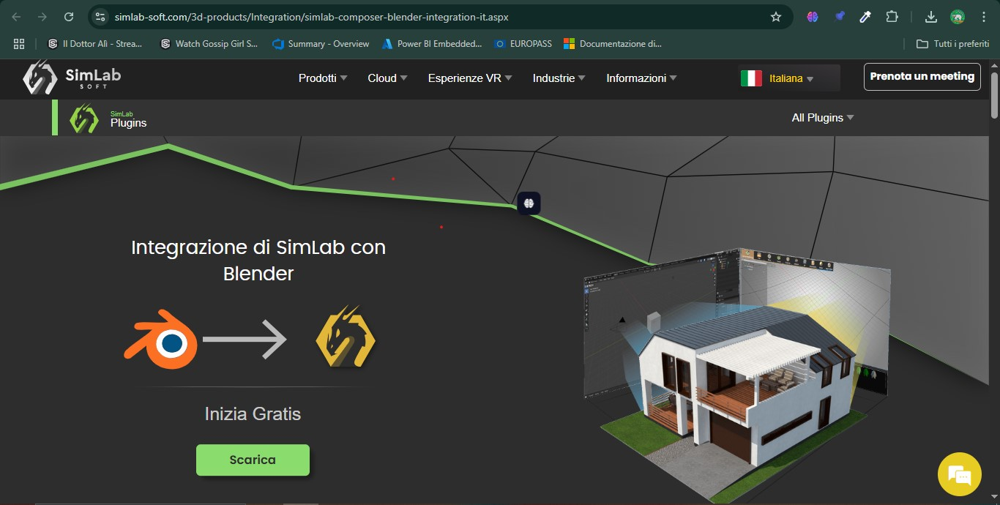
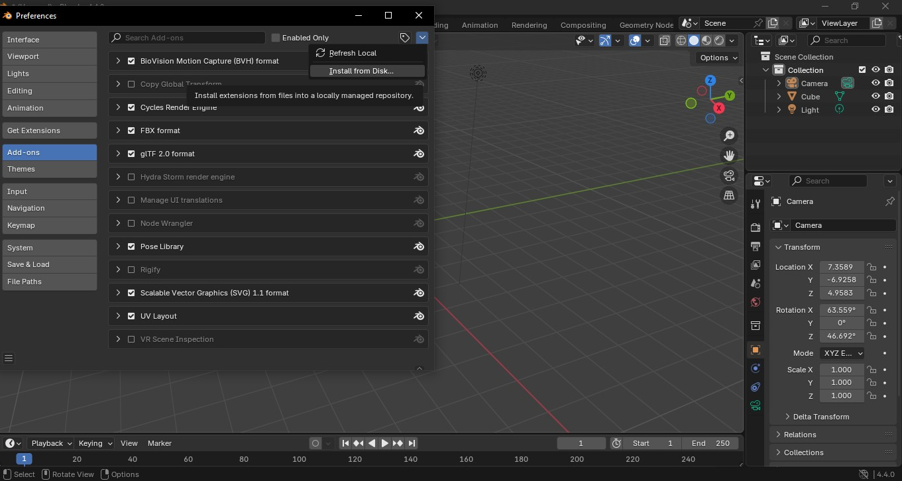
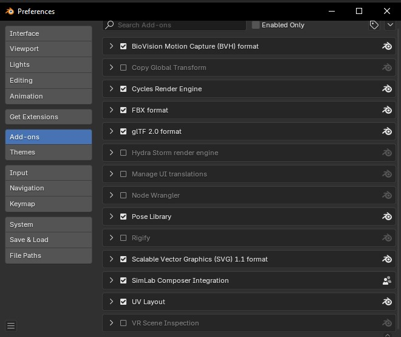
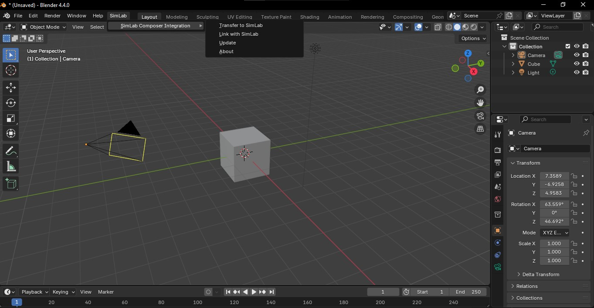
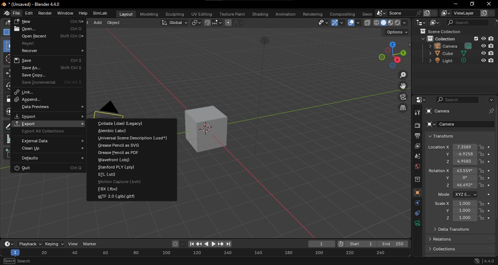

Blender è un software di modellazione 3D open-source, gratuito e disponibile per tutte le principali piattaforme (Windows, macOS e Linux). È utilizzato sia da amatori che da professionisti nel campo della grafica 3D per una vasta gamma di applicazioni.
### Caratteristiche 
- Blender offre un'ampia gamma di strumenti essenziali fra cui:
   *  **Modellazione:** Blender offre un'ampia varietà di strumenti di modellazione, come la scultura digitale, il necessario per la modifica delle mesh, e i modificatori;
   *  **Texturing e shading:** È possibile creare materiali e texture avanzate per oggetti 3D;
   *  **Animazione:** Consente di animare oggetti e personaggi. Offre anche strumenti avanzati come il motion tracking e il supporto per il rigging facciale.
   *  **Rendering:** Blender è dotato di due motori di rendering: **Cycles** e **Eevee**. Eevee è più leggero e performante e produce risultati meno sofisticati, Cycles è più complesso e genera delle immagini più fotorealistiche.
   *  **Simulazioni fisiche:** Blender permette di simulare fluidi, fumo, tessuti, e particelle in modo semplice e accessibile.
   *  **Video Editing:** Blender include un editor video che consente di modificare video e aggiungere effetti.   

- E' multipiattaforma con un'interfaccia grafica OpenGPL questa interfaccia permette di avere un'esperienza simile su tutte le piattaforme, il che lo rende versatile per utenti che lavorano su sistemi diversi. OpneGPL è stata progettata per essere intuitiva e consentire un alto grado di personalizzazione.
- Offre un'architettura di alta qualità permettendo un flusso di lavoro creativo rapido. L’uso di threading e rendering distribuito consente agli utenti di eseguire operazioni complesse in modo efficiente e la buona gestione della memoria consente di avorare su scene pesanti senza compromettere le prestazioni.
- Blender offre un supporto attivo da parte della comunità. La comunità è composta da professionisti, appassionati, sviluppatori e artisti, che contribuiscono costantemente con tutorial, script, plugin, e soluzioni creative. Ogni giorno si trovano aggiornamenti e miglioramenti alla piattaforma. Inoltre, Blender offre documentazione completa, [forum](https://www.blender.org/community), e gruppi di supporto online dove gli utenti possono scambiarsi idee e risolvere problemi.

---
### Comandi 
### Navigazione Vista 3D
- **Click con rotella mouse** -->  ruota la vista intorno all'oggetto o alla scena
- **Shift + click and drag con rotella** --> muove la vista in orizzontale o in verticale
- **Numpad** --> cambia la vista predefinita della scena (frontale/laterale/superiore ecc)
- **Click destro su un oggetto** --> selezione l'oggetto
- **Click sul vuoto** --> deseleziona l'oggetto
### Base di Trasformazione (modalità Object/Edit)
- **G** --> Grab - Serve per muovere l'oggetto. Puoi anche vincolare il movimento a un asse specifico premendo **X, Y** o **Z**
- **R** --> ruota l’oggetto. Puoi anche vincolare il movimento a un asse specifico premendo **X, Y** o **Z**
- **S** --> ridimensiona l’oggetto
- **Ctrl + Z** --> annulla l’ultima azione
- **Shift + Click destro** --> sposta il 3D Cursor
- **Alt + G / Alt + R / Alt + S** --> reset della posizione (G), rotazione (R) o scala (S) dell'oggetto rispetto al cursore
- **Ctrl + A** --> applica trasformazioni (posizione, rotazione, scala)
### Assi e sistemi di riferimento
- **X, Y, Z** --> vincola trasformazione all’asse selezionato
- **Shift + asse** --> esclude l’asse selezionato dalla trasformazione (es. G + Shift + Z)
- **Sistema coordinate in alto**: puoi passare da **Global**, **Local**, **Normal**, **View**, ecc.
### Modalità di visualizzazione (tasto Z)es,e
- **Solid** --> vista di default
- **Wireframe** --> mostra solo bordi e vertici, è utile per vedere la geometria sottostante
- **Rendered** --> mostra la scena con l'illuminazione, i materiali e le texture applicate, offrendo una preview del risultato finale
### Aggiunta oggetti
- **Shift + A** --> apre il menu per aggiungere oggetti primitivi (cubi, sfere, piani, ecc.) e altri elementi come luci e telecamere
- **Click destro su oggetto --> _Shade Smooth_** per rendere liscia la superficie degli oggetti selezionati
### Snap e Pivot Point
- **Shift + S** --> apre il menù snap, serve per spostare oggetti in base al cursore 3D, allineamento a griglia, vertici ecc..
- **Magnete in alto nella barra** --> attiva/disattiva lo snap per le trasformazioni, aiutando ad allineare oggetti con maggiore precisione.
- **Pivot Point** --> definisce il punto attorno al quale avvengono la rotazione o la scala (può essere il centro dell'oggetto, il cursore, o altro).
### Join, Separate, Origin
- **Ctrl + J** --> _Join_, (unisce oggetti selezionati). Il punto di pivot diventa quello dell'oggetto selezionato per ultimo.
- **Tab** --> Passa dalla modalità **Object** alla modalità **Edit** e viceversa.
### Edit Mode
- **Shift + S** → Apre il menu per spostare il cursore 3D sulla selezione (ad esempio, "Cursor to Selection" sposterà il cursore 3D sulla posizione del vertice/oggetto selezionato).
- **P** --> _Separate_ separa una parte della mesh in un nuovo oggetto.
- **L** --> Seleziona tutta la geometria connessa l’isola di vertici, bordi o facce.
##### Elementi selezionabili in Edit Mode
In alto a sinistra puoi scegliere se lavorare su:
- **Vertici**: seleziona singoli vertici.
- **Bordi**: seleziona bordi (gli spigoli tra due vertici)
- **Facce**: seleziona le facce
##### Strumenti in Edit Mode
- **E** --> _Extrude_, Crea nuova geometria partendo da una selezione.
- **S** --> scala un’estrusione

- **M** --> _Merge_
    *   _By Distance_ --> unisce vertici sovrapposti o vicini       
    *   _At Center / Collapse_ --> fonde mantenendo la forma

- **X** --> apre menù per eliminare:
    *   Vertici  
    *   Bordi       
    *   Facce      
    *   Dissolve (mantiene la forma)
### Loop Cut & Knife
- **Ctrl + R** --> _Loop Cut_ Aggiunge un taglio a ciclo nella geometria.
    *   click --> conferma    
    *   Rotella del mouse --> Aggiungi più tagli o rimuovili.   
    *   In basso a sinistra --> (pannello opzioni) puoi regolare il numero di segmenti e la smussatura.
- **K** --> _Knife_ serve per tagliare la geometria lungo una linea che puoi tracciare liberamente all'interno della modalità **Edit**.
   * **Clic sinistro**: aggiungi un punto di taglio.
   * **Clic destro**: annulla l'ultimo punto aggiunto (si può annullare anche il taglio intero se necessario).
   * **Premi C** per attivare il taglio in modo "tagliato libero", che ti permette di creare tagli curvi, mentre **senza premere C**, il taglio sarà sempre rettilineo.
### Modalità proporzionale
-  **O** --> attiva/disattiva la modalità proporzionale. Quando è attiva, la trasformazione dell'oggetto (muovere, ruotare, scalare) influenzerà anche la geometria vicina in modo graduale. Puoi regolare l’influenza usando la rotella del mouse.
- Usata con G / R / S modifica anche le geometrie vicine con un’influenza graduale

---
## Creazione Modello Armadio
1. **Aprire Blender**
---
2.  **Eliminare il cubo**:
- Premere `X` per eliminare il cubo predefinito.
---
3.  **Aggiungere un Piano (Plane)**:
- Premere `Shift + A` per aprire il menu di aggiunta degli oggetti.
- Dalla sezione **Mesh** e poi selezionare **Plane**.
---
4.  **Modificare il Cubo**:
- Ridimensionare il cubo sui vari assi fino ad ottenere la forma desiderata. Assicurarsi che le dimensioni siano realistiche, in modo tale che gli oggetti creati, quando inseriti nel progetto finale, siano in scala e non necessitino di ridimensionamento.
---
5. **Forma base armadio**:
- In EDIT mode, selezionare una delle facce verticali larghe e usare lo strumento inset (`I`).
- Selezionare la faccia creata ed estruderla rispetto alla sua normale in modo da creare la cavità dell'armadio.
---
6. **Ripiani dell'armadio**:
- Creare un nuovo cubo nella scena, e ridimensionarlo in modo da creare una lastra che della larghezza dell'interno dell'armadio.
- Usando le funzioni di snapping, collocarla all'interno dell'oggetto creato in precedenza.
- Farne un numero adeguato di copie e distribuirle equidistanti lungo l'altezza dell'armadio.
- Assicurarsi che la loro profondità sia minore di quella dell'armadio, così da lasciare lo spazio necessario alle ante.
---
7. **Ante**:
- Similmente allo step precedente, creare due parallelepipedi che abbiano un'altezza pari alla cavità dell'armadio e una larghezza pari a metà della suddetta.
- Posizionarli in modo da chiudere l'armadio.
- In EDIT mode, per ciascuna delle ante, selezionare la faccia laterale più esterna.
- Spostare il cursore all'elemento attivo (`SHIFT + S > Cursor to Active`).
- Uscire dall'EDIT mode e usare la funzione di ricerca per trovare il comando `Origin to 3D Cursor`: ora le ante ruoteranno rispetto a quella faccia.
- Ruotarle sull'asse **Z** così da farle sembrare aperte.

---

## Creazione Modello Cestino
1. **Aprire Blender**
---
2. **Eliminare il cubo**:
- Premere `X` per eliminare il cubo predefinito.
---
3.  **Aggiungere un cilindro**:
- Aggiungere un **nuovo cilindro** con 32 vertici. (`Shift + A > Mesh > Cylinder`)
---
4. **Modificare il cilindro**:
- In modalità EDIT (`TAB`), selezionare la faccia superiore del cilindro.
- Usare lo strumento **inset** (`I`) su di essa, in modo da creare una faccia concentrica a quella originale.
- Una volta fatto, selezionare la nuova faccia ed **estruderla rispetto alla sua normale**, quindi verticalmente, verso il basso: si ottiene così un buco al centro del cilindro.
- Selezionare le due facce inferiori e **ridimensionarle** in modo da dare al cilindro una forma a tronco di cono.
- Aggiungere un taglio orizzontale a metà del modello e scalarlo leggermente verso l'esterno.
---
5. **Rifinire la mesh**:
- Aggiungere un **modifier** di tipo **subdivision surface** all'oggetto. Questo dividerà la geometria già esistente in parti più piccole.
- Aggiungere un taglio nella parte inferiore della geometria e portarlo a combaciare o quasi con il fondo del modello. Tanto più sarà vicino, tanto meno arrotondata sarà la base del cestino.
- Possiamo ripetere questa stessa operazione anche all'interno.

---

## Creazione Modello Cartello Quadrato
1. **Aprire Blender**
---
2.  **Eliminare il cubo**:
- Premere `X` per eliminare il cubo predefinito .
---
3.  **Aggiungere un Piano (Plane)**:
- Premere `Shift + A` per aprire il menu di aggiunta degli oggetti.
- Dalla sezione **Mesh** e poi selezionare **Plane**.
---
4.  **Modificare il Piano**
- Con il quadrato selezionato, premere **R** per ruotarlo.
- Per ruotarlo lungo l'asse **X** di 90 gradi, premere `R + X + 90`.
- Ridimensionare il piano sui vari assi fino ad ottenere la forma desiderata. Assicurarsi che le dimensioni siano realistiche, in modo tale che gli oggetti creati, quando inseriti nel progetto finale, siano in scala e non necessitino di ridimensionamento.
---
5. **Aggiungere modifier**:
- Nella barra a destra, navigare alla sezione modifier.
- Aggiungere un modifier **solidify**: questo conferirà al piano uno spessore pari al valore **thickness**. Due centimentri può essere un valore appropriato.
- Dalla scheda del modifier, applicarlo all'oggetto. L'opzione non è disponibile in EDIT mode, quindi assicurarsi di essere in OBJECT mode.
---
6. **Arrotondare il cartello**:
- In EDIT mode, selezionare i 4 spigoli orizzontali del parallelepipedo che è venuto a crearsi.
- Usando lo strumento **bevel** (`CTRL + B`), arrotondare leggermente la forma dell'oggetto. Per non complicare o appensantire eccessivamente la topologia, non aggiungere più di quattro edge con il bevel.

---

## Creazione Modello Cartello Triangolare
1. Aprire Blender
---
2.  **Eliminare il cubo**:
- Premere **X** per eliminare il cubo predefinito .
---
3.  **Aggiungere un Cilindro (Cylinder)**:
- Premi `Shift + A` per aprire il menu di aggiunta degli oggetti.
- Dalla sezione **Mesh** selezionare **Cylinder**.
- Diminuire il numero di vertici a 3 e impostare l'altezza a due centimetri.
---
4.  **Modificare il Prisma**:
- Con il quadrato selezionato, premere **R** per ruotarlo.
- Per ruotarlo lungo l'asse **X** di 90 gradi, premi `R + X + 90`.
- Ridimensiona il piano sui vari assi fino ad ottenere la forma desiderata. Assicurarsi che le dimensioni siano realistiche, in modo tale che gli oggetti creati, quando inseriti nel progetto finale, siano in scala e non necessitino di ridimensionamento.
---
5. **Arrotonda il cartello**:
- In EDIT mode, selezionare i 3 spigoli orizzontali del prisma a base triangolare che è venuto a crearsi.
- Usando lo strumento **bevel** (`CTRL + B`), arrotondare leggermente la forma dell'oggetto. Per non complicare o appensantire eccessivamente la topologia, non aggiungere più di quattro edge con il bevel.

---
## Importazione dei modelli su SimLab

### Utilizzo del plugin ufficiale di SimLab per Blender
Il plug-in di integrazione SimLab Composer per Blender è uno strumento gratuito sviluppato per semplificare il flusso di lavoro tra Blender e SimLab Composer, una potente piattaforma per la visualizzazione e navigazione di ambienti virtuali, la realtà virtuale e la presentazione interattiva dei progetti 3D. Questo plug-in funge da strato intermedio tra le due applicazioni, consentendo di creare un collegamento attivo e bidirezionale che mantiene il design condiviso costantemente aggiornato. In pratica, ogni modifica apportata al modello in Blender può essere sincronizzata in tempo reale o con un semplice click con SimLab Composer, eliminando la necessità di continue esportazioni e importazioni manuali. Grazie a questo collegamento dinamico, è possibile migliorare notevolmente l'efficienza del processo creativo, ridurre gli errori e accelerare la produzione di contenuti visivi di alta qualità, incluse esperienze VR, animazioni tecniche e presentazioni interattive.
### Come installarlo:
Prima di iniziare bisogna installare il plug-in di integrazione cercando `SimLab Composer Integration for Blender`. 

1. Apri Blender.
2. Nella TopBar di Blender clicca su `Modifica` > `Preferenze`. 

3. Seleziona la scheda Add-ons e clicca su `Installa dal disco` .
 

5. Indica il percorso del **file ZIP** del plug-in scaricato e clicca su Installa.

> **Nota**  
>Quando installi un plugin in Blender, il file ZIP deve essere caricato così com'è, senza decomprimerlo.

6. **Attiva** il plugin nella lista degli add-on.
 

7. Nella TopBar di Blender, troverai una nuova scheda chiamata `SimLab` con l'opzione `Link with SimLab`.
  

###  Esportazione manuale in un formato compatibile

### Esporta il modello da Blender:
1. Apri il tuo progetto in Blender
2. Vai su `File` > `Export` > `FBX` (.fbx)

3. Scegli il percorso e il nome del file
4. A sinistra, nelle opzioni di esportazione, assicurati di selezionare:
	- Apply Transform (per evitare problemi di scala/orientamento)
	- Mesh (se stai esportando un modello 3D statico)
	- Format: Binary

5. Clicca su Export FBX
### Importa il modello su SimLab Composer 
1. clicca su `File`>`Importa`

![[ImportazioneSimlab.png]]
